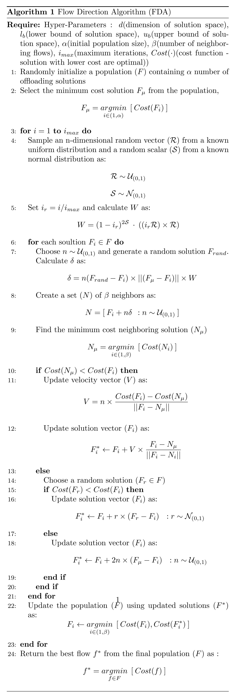

# FDATO
FDA Implementation on benchmark functions and Task-Offloading in Edge Cloud Environment

Original Paper at:
https://www.sciencedirect.com/science/article/abs/pii/S0360835221001285

**Flow Direction Algorithm (FDA): A Novel Optimization Approach for Solving Optimization Problems**

Hojat Karami[a], Mahdi Valikhan Anaraki[a], Saeed Farzin[a] , Seyedali Mirjalili [b,c]

* [a] Department of Water Engineering and Hydraulic Structures, Faculty of Civil Engineering, Semnan University, Semnan, Iran 
* [b] Centre for Artificial Intelligence Research and Optimisation, Torrens University Australia, Fortitude Valley, Brisbane, 4006 QLD, Australia 
* [c] Yonsei Frontier Lab, Yonsei University, Seoul, Republic of Korea   

# Text Citation

Hojat Karami, Mahdi Valikhan Anaraki, Saeed Farzin, Seyedali Mirjalili,

Flow Direction Algorithm (FDA): A Novel Optimization Approach for Solving Optimization Problems,

Computers & Industrial Engineering, Volume 156, 2021, 107224, ISSN 0360-8352,

[DOI](https://doi.org/10.1016/j.cie.2021.107224)

[sciencedirect](https://www.sciencedirect.com/science/article/pii/S0360835221001285)

Abstract: The present study aimed to propose a new optimization algorithm named Flow Direction Algorithm (FDA), which is a physics-based algorithm. The FDA algorithm mimics the flow direction to the outlet point with the lowest height in a drainage basin. In other words, flow moves to neighbor with lowest high or best objective function. Thirteen classic mathematical benchmark functions, ten new mathematical benchmark functions and five engineering design problems, including three-bar truss, tension/compression spring, speed reducer, gear train, and welded beam design, with different properties are considered to evaluate the proposed algorithm. Comparing the results of the FDA with other optimization algorithms demonstrates the superior performance of the FDA in solving challenging optimization problems.

Keywords: Optimization; Heuristic; Benchmark; Metaheuristic; Algorithm; Flow direction method; Mathematical benchmark functions; Engineering problem optimization

___

# Algorithm

